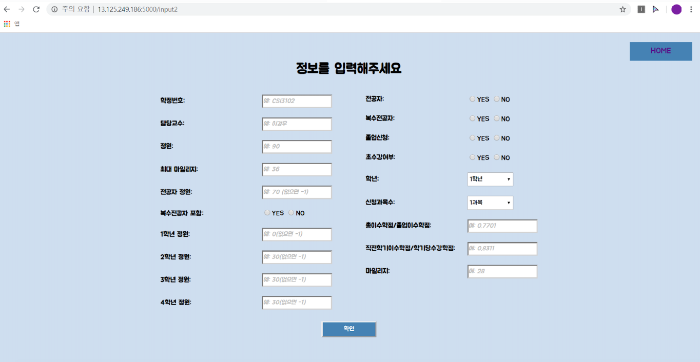

# CourseRegistration-Analysis

개인의 스펙에 따른 해당 과목의 수강 신청 성공 여부 예측 및 웹 구현

 

### Goal

- 수강신청 데이터가 적재된 DB server와 연동된 Web 상에서 직접 강의를 선택

  → 개인의 정보에 따라 예측된 수강 신청 성공 여부를 볼 수 있도록 구현

   

1. 마일리지 우선순위 정보에 따른 예측 모델링 구현
2. pymysql과 flask를 통해 DB server와 연동된 Web 구현
3. 사용자가 Web 상에 입력하는 정보에 따른 성공/실패 여부 출력

 

### Data Used

- Yonsei portal의 수강신청 정보
  - https://portal.yonsei.ac.kr/main/

 

### Tech/Framework Used

- Crawling
  - Selenium
  - BeautifulSoup
- Database
  - MySQL
  - pyMySQL
- Machine Learning
  - Scikit-learn
  - XGBoost
  - GridSearchCV
- Web
  - Flask
  - HTML
  - CSS
  - JavaScript

 

### Screenshots

